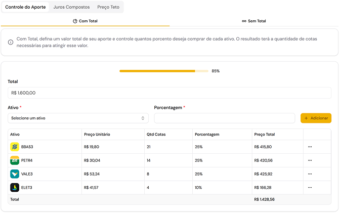
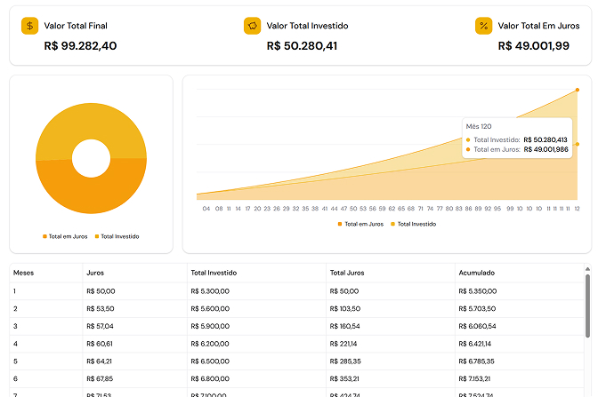
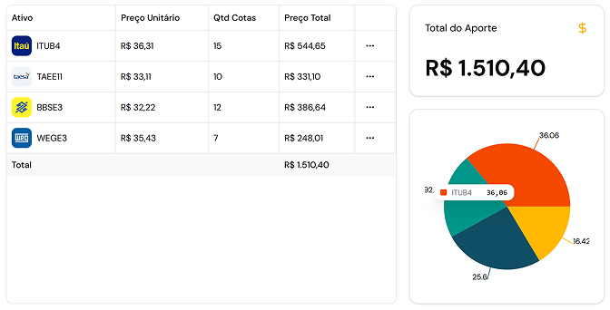

# Aporte Certo

Decida seus investimentos em minutos, não em horas: Calculadoras para investidores. Acesse em: [aportecerto.com.br](https://www.aportecerto.com.br)

### 🚀 Tecnologias utilizadas:

- Figma (UI/UX Design)
- Next.js
- Tailwind
- Shadcn/ui
- Brapi
- Supabase

##

### 📷 Algumas imagens...

